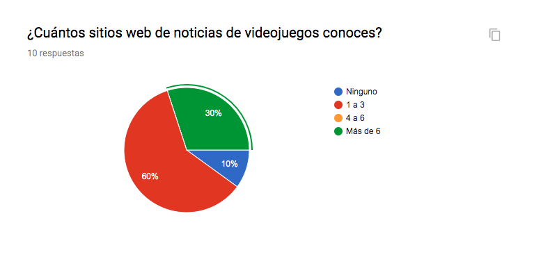
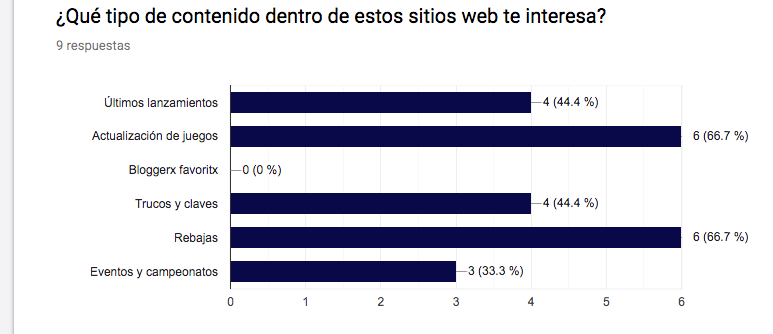

# Data Lovers-Steam

## Índice

- [Introducción](#introducción)
- [Descripción general del proyecto](#descripción-general-del-proyecto)
- [Avance](#avance)
- [Información recabada](#información-recabada)
- [Prototipo de baja fidelidad](#prototipo-de-baja-fidelidad)
- [User Persona](#user-persona)

---

## Introducción

Steam es una de las mejores plataformas a las que acudir para jugar a videojuegos desde un ordenador. Nació en septiembre de 2003 de la mano de Valve, como plataforma de distribución digital, y en ella encontramos títulos tanto de pequeños desarrolladores independientes como de grandes estudios.

Para utilizarla, lo único que necesitamos es registrarnos en la web oficial de Steam (sin coste alguno), con lo que crearemos una cuenta de usuario a la que asociar todos los videojuegos que compremos. Así, nada más loguearnos en cualquier otro ordenador, dispondremos en él de todos los títulos que hubiésemos adquirido previamente, pudiendo descargarlos cuando deseemos.

Actualmente, hay más de 3.000 juegos disponibles en Steam y 75 millones de cuentas de usuario activas. En esta plataforma podemos encontrar tanto juegos gratuitos como otros muchos con suculentas ofertas e incluso posibildiad de jugar gratis durante varios días a un juego en promoción.

---

## Descripción general del proyecto

Este proyecto se trabajó por la dupla conformada por María Itzel Erika Enciso Ibáñez y Monserratt Cuevas Serrano; se busca *construir una _página web_ para visualizar el conjunto de datos de noticias de la página de STEAM*.

---

##Avance

Se realizaron 12 encuestas (6 mujeres y 6 hombres) que nos ayudaron a recabar información sobre: las necesidades, rango de edad, sexo, preferencias,  _pains, gains_ y comportamientos de los usuarios, y así, poder contruir una interfaz aque se adecúe a las necesidades del usuario.

Se contruyó un prototipo de papel sobre la interfaz de la página web, a partir del análisis de la información recabada por medio de las encuestas. Este prototipo será testeado con, por lo menos, 5 potenciales usuarios de nuestra página web para verificar usabilidad, intutividad y diseño  de nuestro prototipo

Como entregable final crearémos una página web que permita **visualizar la data,
filtrarla, ordenarla y hacer algún cálculo agregado**. Especificamente se buscará que nuestra página web sea capaz de:

- [ ] Presentar la data en orden cronológico
- [ ] Filtrar la data por título de la notica
- [ ] Filtrar la data por autor de la noticia
- [ ] Organizar la data por etiquetas (_canales_)

### Información recabada

### Prototipo de baja fidelidad

---

##User Persona

##Pains y Gains

## Historias de usuario

El usuario busca mantenerse actualizado respecto a 

### Definición de terminado

