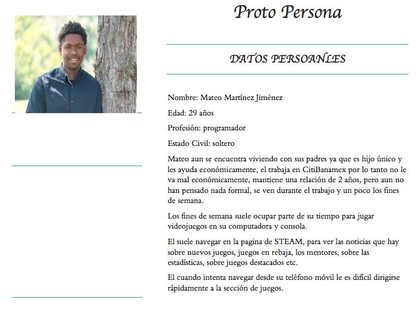
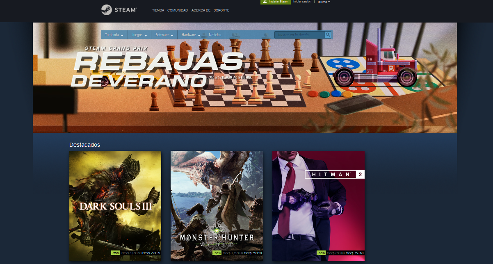
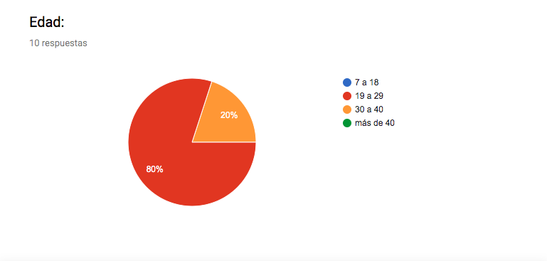
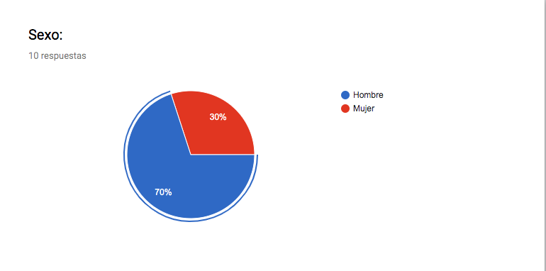
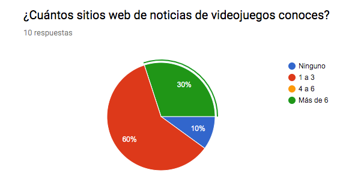
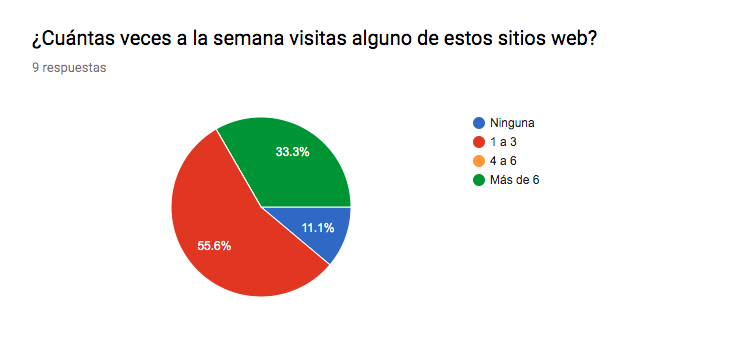
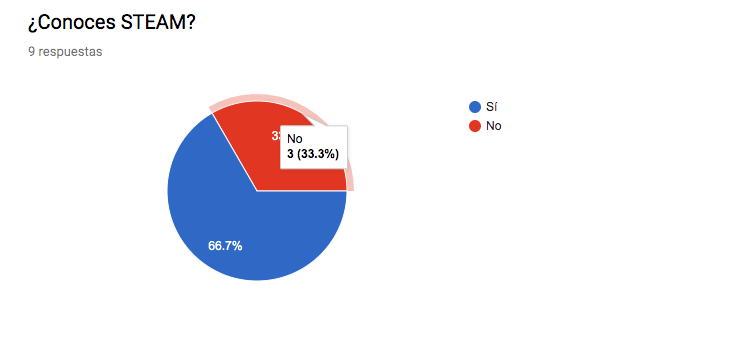
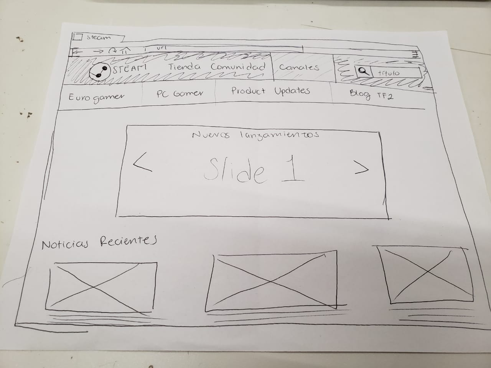

# Data Lovers-Steam

## Índice

- [Introducción](#introducción)
- [Descripción general del proyecto](#descripción-general-del-proyecto)
- [Avance](#avance)
- [Información recabada](#información-recabada)
- [User Persona](#user-persona)
- [Pains y Gains](#pains-y-gains)
- [Historias de Usuario](#historias-de-usuario)
- [Prototipo de baja fidelidad](#prototipo-de-baja-fidelidad)

---
## Proto Persona

## Introducción

Steam es una de las mejores plataformas a las que acudir para jugar a videojuegos desde un ordenador. Nació en septiembre de 2003 de la mano de Valve, como plataforma de distribución digital, y en ella encontramos títulos tanto de pequeños desarrolladores independientes como de grandes estudios.

Para utilizarla, lo único que necesitamos es registrarnos en la web oficial de Steam (sin coste alguno), con lo que crearemos una cuenta de usuario a la que asociar todos los videojuegos que compremos. Así, nada más loguearnos en cualquier otro ordenador, dispondremos en él de todos los títulos que hubiésemos adquirido previamente, pudiendo descargarlos cuando deseemos.

Actualmente, hay más de 3.000 juegos disponibles en Steam y 75 millones de cuentas de usuario activas. En esta plataforma podemos encontrar tanto juegos gratuitos como otros muchos con suculentas ofertas e incluso posibildiad de jugar gratis durante varios días a un juego en promoción.

---

## Descripción general del proyecto

Este proyecto se trabajó por la dupla conformada por María Itzel Erika Enciso Ibáñez y Monserratt Cuevas Serrano; se busca *construir una _página web_ para visualizar el conjunto de datos de noticias de la página de STEAM*.

## Avance

Se realizaron 12 encuestas que nos ayudaron a recabar información sobre: las necesidades, rango de edad, sexo, preferencias,  _pains, gains_ y comportamientos de los usuarios, y así, poder contruir una interfaz que se adecúe a las necesidades del usuario.

A partir del análisis de la información recabada se contruyó un prototipo de papel sobre la interfaz de la página web. Este prototipo será testeado con, por lo menos, 5 potenciales usuarios de nuestra página web para verificar usabilidad, intuitividad y diseño  del prototipo.

Como entregable final crearémos una página web que permita **visualizar la data,
filtrarla, ordenarla y hacer algún cálculo agregado**.

Especificamente se buscará que la página web sea capaz de:
- [ ] Presentar la data en orden cronológico
- [ ] Filtrar la data por título de la notica
- [ ] Filtrar la data por autor de la noticia
- [ ] Organizar la data por etiquetas (_canales_)

### Información recabada

Se realizó la encuesta a 6 hombres y 6 mujeres, 2 de las mujeres no conocían ninguno de los sitios web de noticias de videojuegos y no jugaban videojuegos, por lo cuál, se eliminaron estás encuestas; quedándonos con sólo 10 encuestas de las cuáles se rescató la siguiente información:

El 80% de los usuarios se encuentran entre los 19 y 29 años de edad.

El 70% de los usuarios se encuentran son hombres. Mientras que el 30% de los usuarios son mujeres.

El 60% de los usuarios conocen de 1 a 3 sitios webs de noticias de videojuegos. Mientras que el 30% de los usuarios conocen más de 6.

El 55.6% de los usuarios visitan de 1 a 3 veces por semana estos sitios. Mientras que el 33.3% de los usuarios los visitan más de 6 veces por semana y aprox el 11% ninguna vez a la semana.

Sólo el 66.7% de los usuarios conocen STEAM.

## User Persona

Hombre/mujer de entre 23 y 36 años que pertenece a la industria de la tecnología. Trabaja entresemana, por lo cual, espera al fin de semana para desestresarse jugando su videojuego favorito. Usualmente juega solx en casa ya que no tienen tanta facilidad de acordar horarios con otros jugadores. Necesitan algo que los mantenga actualizados que cumpla las siguientes características:

- Rápido
- Intituitivo
- Sin anuncios
- Navegación directa
- Mobile first

## Pains y Gains

### Pains
- Anuncios
- Falta de actualización
- Sobrecarga de información
- Falta de publicidad a desarolladores menores

### Gains
- Mantenerse actualizado constantemente
- Enterarse de rebajas y eventos
- Encontrar actualizaciones de sus juegos favoritos
- Encontrar trucos y claves para sus juegos favoritos

## Historias de usuario

Yo usuario busco mantenerme actualizadx con la noticias publicadas por mi autor o bloggerx favoritx:

- Entro a la _página web_ de noticias STEAM
- Localizo la barra de búsqueda e ingreso el nombre de mi autor / bloggerx favoritx
- El sitio muestra un listado de todas las noticias de mi autor / bloggerx favoritx

---

## Prototipo de baja fidelidad

A continuación se muestra el prototipo de baja fidelidad que se creo para hacer el primer testeo de la interfaz.

